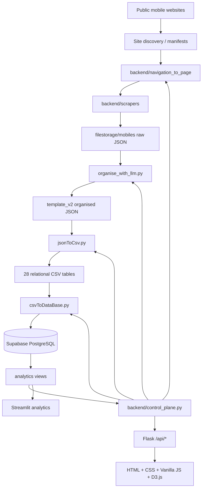

<h1 align="center">MobileInfoAnalytics</h1>

<p align="center"><strong>Mobile Price Intelligence & Smartphone Market Analytics</strong></p>
<p align="center">A multi-source smartphone data engineering, comparison, dashboarding and analytics platform developed as an internship project.</p>

---

## Overview

**MobileInfoAnalytics** is an end-to-end smartphone market intelligence system that collects mobile-phone data from multiple public web sources, normalizes inconsistent specifications into a common schema, links equivalent products across websites, loads the resulting relational data into **Supabase/PostgreSQL**, and exposes the data through interactive **Flask**, **Streamlit**, **D3.js**, and vanilla-JavaScript analytics interfaces.

The repository covers the complete workflow:

```text
Site discovery
    ↓
Sitemap / catalogue filtering
    ↓
Playwright navigators
    ↓
Site-specific HTML scrapers
    ↓
Raw product JSON
    ↓
Together AI assisted normalization
    ↓
template_v2 organised JSON
    ↓
Relational CSV generation
    ↓
Validation + Supabase preflight
    ↓
Resumable/idempotent database upload
    ↓
Analytics views + Flask API
    ↓
Dashboard / database explorer / scraper controls / real-time analytics
```

The project is designed around two important principles:

1. **Canonical product identity is source-independent.** The database links equivalent phones across different websites through normalized product slugs and aliases rather than depending on any single marketplace.
2. **Marketplace listings preserve their own specifications.** A listing can disagree with the canonical specification, allowing the system to identify vendor-side specification discrepancies instead of silently overwriting them.

---

## Table of Contents

- [Project Status](#project-status)
- [Key Features](#key-features)
- [Current Data Snapshot](#current-data-snapshot)
- [Supported Data Sources](#supported-data-sources)
- [System Architecture](#system-architecture)
- [Scraping Architecture](#scraping-architecture)
- [Site Discovery and URL Manifests](#site-discovery-and-url-manifests)
- [Data Normalization Pipeline](#data-normalization-pipeline)
- [Database Architecture](#database-architecture)
- [Analytics Views](#analytics-views)
- [Frontend](#frontend)
- [Backend Control Plane](#backend-control-plane)
- [Repository Structure](#repository-structure)
- [Installation](#installation)
- [Environment Configuration](#environment-configuration)
- [Database Setup](#database-setup)
- [Running the Data Pipeline](#running-the-data-pipeline)
- [Running Scrapers](#running-scrapers)
- [Running the Frontend](#running-the-frontend)
- [Testing and Verification](#testing-and-verification)
- [Security Model](#security-model)
- [Documentation Guide](#documentation-guide)
- [Legacy Documentation Notes](#legacy-documentation-notes)
- [Contributors](#contributors)
- [License](#license)

---

## Project Status

This repository represents the completed integration of the internship project's core data workflow:

- multi-site smartphone scraping;
- resumable scraping and crawl-state handling;
- LLM-assisted specification cleaning and schema normalization;
- relational JSON-to-CSV conversion;
- validation of all **28 database tables**;
- Supabase custom-schema preflight;
- completed upload of the prepared dataset to Supabase;
- PostgreSQL functions and analytics views;
- Flask control API and governed operations layer;
- production Flask/Streamlit frontend on `main`;
- an alternative React/TypeScript/Next.js frontend on a separate branch.

The `main` branch is the canonical branch documented by this README.

---

## Key Features

### Multi-source mobile intelligence

The system aggregates smartphone listings and specifications from several Pakistani and international mobile-data sources, allowing cross-site price and specification comparison.

### Canonical GSMArena specifications

GSMArena acts as the preferred canonical specification source when canonical records are available. Marketplace records remain separate and retain their own values for discrepancy analysis.

### Product linking across websites

The catalog layer resolves different names for the same device through:

- standardized company names;
- normalized product slugs;
- product aliases;
- source-aware matching;
- deterministic relational IDs during CSV generation.

### LLM-assisted normalization

Raw scraper values are converted into the strict `template_v2.json` structure using **Together AI** models for fields that require semantic interpretation, while deterministic Python handles operations such as:

- URL reconstruction;
- company-name normalization;
- release-date parsing;
- numeric/unit conversion;
- enum enforcement;
- template defaults;
- validation and output routing.

### Resumable ETL

The data pipeline is designed to survive interruption:

- organiser state is persisted during LLM processing;
- scraper output is written atomically;
- upload progress is persisted after committed batches;
- database writes use deterministic IDs and idempotent upserts;
- transient HTTP failures use retry/backoff;
- irreducible row errors can be isolated rather than discarding an entire table.

### Production analytics frontend

The `main` branch includes a live frontend built only with:

- Flask
- Streamlit
- HTML
- CSS
- D3.js
- Vanilla JavaScript

The browser does **not** connect directly to Supabase and does not execute arbitrary shell commands or SQL.

---

## Current Data Snapshot

The latest prepared dataset used for the completed Supabase load contained:

| Metric | Count |
|---|---:|
| Organised smartphone records | 4,303 |
| Canonical catalog products | 2,808 |
| Marketplace listings | 4,120 |
| Structured price rows | 3,627 |
| Companies / brands | 115 |
| Relational database tables | 28 |
| Total relational rows generated | 58,172 |

These values describe the internship dataset snapshot used by the final relational pipeline; future scrapes can increase these counts.

---

## Supported Data Sources

The current production scraper/frontend workflow focuses on the following sources:

| Source | Role | Discovery / Crawl Strategy |
|---|---|---|
| **GSMArena** | Preferred canonical specification source | Manifest-first, resumable, rate-limit-aware crawler |
| **Daraz.pk** | Marketplace listings and prices | Smartphone catalogue discovery and product-card traversal |
| **Mega.pk** | Marketplace listings and specifications | Filtered mobile manifest |
| **MyMobile.pk** | Marketplace/mobile catalog data | Manifest entries plus category/product discovery |
| **WhatAMobile.com.pk** | Mobile listings and specifications | Direct filtered product manifest |
| **WhatMobile.com.pk** | Mobile prices and specifications | Catalog-page discovery followed by product scraping |

The repository also contains `priceoye.pk.py` scraper/navigation files. They are not part of the six-source production scraper surface currently exposed by the main frontend.

---

## System Architecture



The frontend therefore sits on top of the same scraper and ETL implementation used from the command line rather than maintaining a second copy of the business logic.

---

## Scraping Architecture

Scraping is intentionally separated into two layers.

### `backend/navigation_to_page/`

The navigator layer is responsible for reaching the correct product pages and managing crawl execution. Depending on the site, this includes:

- manifest loading;
- catalogue traversal;
- pagination;
- URL validation;
- stable range selection with `--min` / `--max`;
- duplicate removal;
- retries;
- delays;
- resumable output;
- failure logs;
- crawl summaries;
- Playwright browser/session management.

### `backend/scrapers/`

The scraper layer is responsible only for parsing an already-loaded product page into the project's raw mobile JSON structure.

Each site has its own parser because page templates and available specification fields differ significantly between vendors.

This separation keeps page navigation, crawl policy and retries independent from HTML extraction logic.

### Typical flow

```text
Navigator
  └── opens product URL with Playwright
        └── passes page HTML to site scraper
              └── scraper.to_template()
                    └── writes filestorage/mobiles/<site>/<product>.json
```

### Resumability

The navigators generally:

- skip an existing valid JSON output unless `--force` is used;
- write files atomically;
- append final failures to `_failures.jsonl`;
- write `_crawl_summary.json` after a run.

### GSMArena crawl policy

GSMArena has additional conservative request controls. Its navigator persists crawl-policy state, applies server cooldowns, supports stable 1-based inclusive ranges, and stops on explicit refusal responses such as HTTP `403`, `429`, or relevant `503` responses.

The current GSMArena implementation intentionally does **not** use proxy rotation or identity rotation to bypass a server refusal. If a cooldown is returned, the crawler records the resume time and should be restarted only after that cooldown.

See [`backend/navigation_to_page/GSMARENA_CRAWLING.md`](backend/navigation_to_page/GSMARENA_CRAWLING.md) for crawler-specific operational notes.

---

## Site Discovery and URL Manifests

Before scraping, the repository can construct a site tree from website sitemaps.

### 1. Site list

`backend/site-list.txt` groups targets into sections such as:

```text
MAIN_SITE:
...
SITES:
...
UNAUTHORIZED_SITES:
...
```

Entries under `UNAUTHORIZED_SITES:` are skipped by the sitemap builder and are not requested.

### 2. Sitemap discovery

Run:

```bash
python filestorage/treeConstructor.py
```

The script:

- checks `robots.txt` for declared sitemap locations;
- falls back to common sitemap paths when necessary;
- supports sitemap indexes and compressed `.xml.gz` files;
- recursively collects URLs with a depth guard;
- writes hierarchical JSON to `filestorage/sitemap/`.

### 3. Mobile URL filtering

Run:

```bash
python filestorage/FilterMobileUrls.py
```

Filtered mobile-oriented manifests are written under:

```text
filestorage/sitemap_mobile/
```

These manifests are used directly by several production navigators.

---

## Data Normalization Pipeline

### Stage 1 — Raw scraper JSON

Scrapers write source-specific records under:

```text
filestorage/mobiles/<source-domain>/
```

Raw fields may contain inconsistent text such as:

```text
163.3 x 76.6 x 8.2 mm
5500 mAh
AMOLED, 120Hz, 1800 nits peak
128GB 8GB RAM
```

### Stage 2 — `template_v2` organisation

`filestorage/organise_with_llm.py` converts raw data into the strict schema defined by:

```text
filestorage/template_v2.json
```

Output is written under:

```text
filestorage/mobiles_organised/<source-domain>/
```

The organiser uses a pool of Together AI models with retries/fallbacks for free-text interpretation while retaining deterministic Python validation and defaults.

Example:

```bash
python filestorage/organise_with_llm.py --sites all
```

Useful options include:

```bash
python filestorage/organise_with_llm.py --sites gsmarena.com --limit 50 --dry-run
python filestorage/organise_with_llm.py --sites daraz.pk,mega.pk --batch-size 4 --workers 8
python filestorage/organise_with_llm.py --sites all --fresh
```

The organiser can be safely rerun because completed/failed file state is persisted per source.

### `template_v2` structure

The normalized record includes fields for:

- company and device identity;
- source URL;
- 2G/3G/4G/5G support;
- announcement/release dates;
- dimensions, weight, SIM types and resistance;
- display technology, refresh rate, brightness, resolution and pixel density;
- OS, chipset, manufacturing node, CPU and GPU;
- storage/RAM variants;
- main and selfie cameras;
- sound;
- Wi-Fi, Bluetooth, positioning, NFC, infrared, radio and USB;
- fingerprint location;
- battery capacity and charging;
- colors;
- prices.

### Stage 3 — Relational CSV conversion

Run:

```bash
python filestorage/jsonToCsv.py
```

The converter transforms organised JSON into the exact table hierarchy expected by `db/schema_supabase.sql`:

```text
filestorage/csvs/
├── catalog/
├── specs/
├── listings/
├── metadata/
├── staging/
└── _manifest/
```

It generates deterministic positive BIGINT IDs so foreign-key relationships remain stable before a live PostgreSQL session exists.

### Stage 4 — Supabase upload

`filestorage/csvToDataBase.py` validates and uploads the generated CSV hierarchy using the Supabase Data REST API.

The loader provides:

- exact header/schema validation;
- typed row validation;
- foreign-key-safe import ordering;
- deterministic upserts;
- resumable upload state;
- bounded batch and payload sizes;
- retry/backoff for transient failures;
- batch bisection for identifying bad rows;
- custom-schema preflight;
- post-upload row-count verification.

---

## Database Architecture

The active database implementation is **Supabase PostgreSQL**.

`db/schema_supabase.sql` creates the following schemas:

| Schema | Purpose |
|---|---|
| `catalog` | Source-independent brand/product identity and aliases |
| `specs` | Canonical/best-known product specifications |
| `listings` | Per-source marketplace listings, prices and listing-specific specs |
| `metadata` | Scrape runs, ETL rejects and data-quality scoring |
| `staging` | Raw JSON landing/staging records |
| `analytics` | Stable analytical views consumed by the application |
| `etl` | Database-side ingestion functions/procedures |

### Relational table count

The CSV-backed database contains **28 tables**:

| Schema | Tables |
|---|---:|
| `catalog` | 3 |
| `specs` | 10 |
| `listings` | 11 |
| `metadata` | 3 |
| `staging` | 1 |
| **Total** | **28** |

### Catalog

Core product identity tables:

```text
catalog.companies
catalog.products
catalog.product_aliases
```

### Canonical specifications

Canonical specification header plus category tables:

```text
specs.product_specs
specs.spec_network
specs.spec_body
specs.spec_display
specs.spec_platform
specs.spec_memory
specs.spec_camera_main
specs.spec_camera_selfie
specs.spec_connectivity
specs.spec_battery
```

### Marketplace listings

Each marketplace listing has its own specification records:

```text
listings.market_listings
listings.listing_prices
listings.listing_network
listings.listing_body
listings.listing_display
listings.listing_platform
listings.listing_memory
listings.listing_camera_main
listings.listing_camera_selfie
listings.listing_connectivity
listings.listing_battery
```

### Metadata and staging

```text
metadata.scrape_runs
metadata.data_quality
metadata.etl_rejects
staging.raw_json_records
```

---

## Analytics Views

`db/functions_supabase.sql` creates five primary analytical views.

### `analytics.v_canonical_products`

A flattened canonical phone/specification view for product-level analytics.

Useful for questions such as:

- which phones support 5G;
- which devices use AMOLED/OLED displays;
- battery capacity comparison;
- chipset/OS/release analysis.

### `analytics.v_market_listings_full`

A flattened per-listing view combining product identity, listing information, prices and listing-specific specifications.

### `analytics.v_price_comparison`

Cross-site price comparison with aggregates such as:

- source count;
- minimum price;
- average price;
- maximum price;
- price spread;
- listing details.

### `analytics.v_spec_discrepancies`

Compares marketplace values against canonical specifications to identify cases where a listing reports different device characteristics.

### `analytics.v_site_summary`

Provides source-level coverage and quality metrics such as product/listing counts and completeness.

---

## Frontend

There are **two frontend implementations**, and they must not be confused.

### `main` branch — Flask / Streamlit frontend

The `main` branch contains the supported frontend built with:

```text
Flask
Streamlit
HTML
CSS
D3.js
Vanilla JavaScript
```

It does **not** use React, TypeScript or Next.js.

The main application architecture is:

```text
Browser
  ↓
Flask /api/*
  ↓
backend/control_api.py
  ↓
backend/control_plane.py
  ├── Supabase Data REST API
  ├── backend/navigation_to_page/*.py
  ├── filestorage/organise_with_llm.py
  ├── filestorage/jsonToCsv.py
  └── filestorage/csvToDataBase.py
```

The interface is organized around the major product areas defined for the project:

- Scrapers
- Admin / operations
- Database view
- Dashboard
- Real-time analytics

Streamlit remains available as a separate live analytics surface.

The production UI contains no invented fallback product, price, metric, run, chart or event fixture dataset. If live services fail, the interface surfaces the connection/error state instead.

See [`frontend/README.md`](frontend/README.md) and [`frontend/AIMS.md`](frontend/AIMS.md).

### `ts-frontend` branch — React / TypeScript / Next.js

An alternative frontend exists on the separate [`ts-frontend`](https://github.com/malaika-khan12/MobileInfoAnalytics/tree/ts-frontend) branch.

That branch uses **React, TypeScript and Next.js** and proxies browser requests through a same-origin Next.js route to the Python control service.

**It is not part of `main`.**

This distinction is intentional: the canonical `main` implementation remains the Flask/Streamlit/HTML/CSS/D3.js/vanilla-JavaScript frontend.

---

## Backend Control Plane

The production frontend does not invoke scripts or database resources directly from browser JavaScript.

`backend/control_api.py` exposes the Flask API, while `backend/control_plane.py` owns controlled access to Supabase and repository operations.

### Public/read endpoints

Examples include:

```text
GET /api/health
GET /api/dashboard
GET /api/views
GET /api/data/<view>
```

### Authentication endpoints

```text
POST /api/auth/login
POST /api/auth/logout
GET  /api/auth/status
```

### Governed operations

```text
POST /api/operations
GET  /api/jobs
GET  /api/jobs/<id>
POST /api/jobs/<id>/cancel
```

Operational metadata and write/ETL actions require an authenticated operator session.

The operations endpoint accepts only allowlisted operation types implemented by the control plane. Arbitrary SQL, executable paths, raw command strings and shell fragments are rejected.

ETL/database operations are serialized to prevent conflicting writes. Scraper jobs may run concurrently only where the control-plane concurrency rules permit them.

Persistent job metadata/logs are stored under:

```text
filestorage/control_plane_jobs/
```

---

## Repository Structure

```text
MobileInfoAnalytics/
├── backend/
│   ├── navigation_to_page/      # Playwright navigators and crawl logic
│   ├── scrapers/                # Single-product HTML parsers
│   ├── control_api.py           # Flask API endpoints
│   └── control_plane.py         # Supabase + governed job/orchestration layer
│
├── db/
│   ├── schema_supabase.sql      # Active Supabase/PostgreSQL schema
│   ├── functions_supabase.sql   # Catalog/ETL functions + analytics views
│   ├── frontend_api_grants.sql  # Permission grants for frontend analytics access
│   ├── README_SCHEMA_SUPABASE.md
│   ├── README_FUNCTIONS_SUPABASE.md
│   └── database_architecture_v2.md
│
├── filestorage/
│   ├── sitemap/                 # Full discovered sitemap trees
│   ├── sitemap_mobile/          # Filtered mobile URL manifests
│   ├── mobiles/                 # Raw scraper JSON output (runtime/generated)
│   ├── mobiles_organised/       # template_v2 organised JSON (runtime/generated)
│   ├── csvs/                    # Relational CSV output (runtime/generated)
│   ├── treeConstructor.py
│   ├── FilterMobileUrls.py
│   ├── organise_with_llm.py
│   ├── jsonToCsv.py
│   ├── jsonToDataBase.py
│   ├── csvToDataBase.py
│   ├── template.json
│   └── template_v2.json
│
├── frontend/
│   ├── templates/               # Flask HTML templates
│   ├── static/                  # Production static files
│   ├── css/
│   ├── js/
│   ├── media/
│   ├── tests/
│   ├── app.py                   # Flask application
│   ├── streamlit_app.py         # Streamlit analytics application
│   ├── AIMS.md
│   ├── BACKEND_CONTRACTS.md
│   └── README.md
│
├── scripts/                     # Repository support/verification scripts
├── tests/                       # Additional repository tests
├── PRODUCTION_INTEGRATION.md
├── TEST_RESULTS.md
├── requirements.txt
├── LICENSE
└── README.md
```

Generated/runtime directories may not be committed in every clone and can be created by the pipeline as required.

---

## Installation

### 1. Clone the repository

```bash
git clone https://github.com/malaika-khan12/MobileInfoAnalytics.git
cd MobileInfoAnalytics
```

### 2. Create a Python environment

Use any recent supported Python 3 environment or virtual environment.

Example:

```bash
python -m venv .venv
```

Activate the environment using the appropriate command for your operating system, then install the repository dependencies:

```bash
python -m pip install --upgrade pip
python -m pip install -r requirements.txt
```

### 3. Install Playwright Chromium

```bash
python -m playwright install chromium
```

The codebase is intended to work from Windows as well as Linux/WSL paths.

---

## Environment Configuration

Create a `.env` file in the repository root.

Example:

```dotenv
# Supabase
SUPABASE_URL=https://<project-ref>.supabase.co

# Used by the CSV loader. Must be a write-capable server credential.
SUPABASE_KEY=sb_secret_...

# Frontend/control-plane credentials
SUPABASE_PUBLISHABLE_KEY=sb_publishable_...
SUPABASE_SECRET_KEY=sb_secret_...

# LLM organisation
TOGETHER_API_KEY=...

# Operator authentication
MOBILE_ANALYTICS_ADMIN_TOKEN=<long-random-operator-token>
FLASK_SECRET_KEY=<different-long-random-session-secret>

# 0 for local HTTP development; use 1 behind HTTPS in production.
MOBILE_ANALYTICS_SECURE_COOKIES=0

# Optional when running the control/frontend code outside the repository root.
# MOBILE_ANALYTICS_REPO_ROOT=/absolute/path/to/MobileInfoAnalytics
```

### Important

- Never commit real keys or tokens.
- Do not place Supabase secret/service credentials in browser JavaScript.
- `SUPABASE_KEY` is required by the CSV uploader.
- The control plane prefers `SUPABASE_SECRET_KEY` and can fall back to compatible server-key names implemented in the backend.
- Use generated high-entropy values for `MOBILE_ANALYTICS_ADMIN_TOKEN` and `FLASK_SECRET_KEY`.

---

## Database Setup

The current database target is **Supabase PostgreSQL**.

### 1. Create the schema

Run:

```text
db/schema_supabase.sql
```

in the Supabase SQL editor or through an appropriate PostgreSQL client.

### 2. Install functions and analytics views

Run:

```text
db/functions_supabase.sql
```

This creates the catalog helpers, ETL ingestion logic and analytics views.

### 3. Apply frontend analytics grants

After the functions SQL, run:

```text
db/frontend_api_grants.sql
```

This grant file is permission-only and is required because the analytics views are created after the broader grants in the base schema.

### 4. Expose required Supabase Data API schemas

In the Supabase project settings, expose the custom schemas required by the loader/frontend, including as appropriate:

```text
catalog
specs
listings
metadata
staging
analytics
```

Schema exposure is a Supabase project setting and is separate from PostgreSQL `GRANT` statements.

---

## Running the Data Pipeline

Run commands from the repository root.

### 1. Organise raw data

```bash
python filestorage/organise_with_llm.py --sites all
```

### 2. Generate relational CSVs

```bash
python filestorage/jsonToCsv.py
```

### 3. Validate all CSV tables locally

```bash
python filestorage/csvToDataBase.py --dry-run
```

This performs local validation without using Supabase credentials or network access.

### 4. Run Supabase preflight

For a database that is intentionally already populated:

```bash
python filestorage/csvToDataBase.py --preflight-only --allow-existing
```

Preflight validates the CSV tree, credentials, required exposed schemas and target database state without uploading rows.

### 5. Upload

Fresh/empty target:

```bash
python filestorage/csvToDataBase.py
```

Intentional upload into an already-populated target:

```bash
python filestorage/csvToDataBase.py --allow-existing
```

The loader persists progress and is designed to be rerun safely after interruption. Use its replay/reset flags only when deliberately replaying previously completed state.

### Database-side JSON ingestion

The repository also includes a direct JSON/database path and the database function:

```text
etl.ingest_template_v2_json(...)
```

for workflows that ingest normalized `template_v2` records directly instead of loading the generated relational CSV hierarchy.

---

## Running Scrapers

All examples below are intended to be run from the repository root.

### GSMArena

```bash
python backend/navigation_to_page/www.gsmarena.com.py --min 1 --max 5
```

Dry-run the manifest without starting a browser:

```bash
python backend/navigation_to_page/www.gsmarena.com.py --dry-run
```

### Daraz

```bash
python backend/navigation_to_page/www.daraz.pk.py --min 1 --max 5
```

### Mega.pk

```bash
python backend/navigation_to_page/www.mega.pk.py --min 1 --max 5
```

### MyMobile.pk

```bash
python backend/navigation_to_page/mymobile.pk.py --min 1 --max 5
```

### WhatAMobile.com.pk

```bash
python backend/navigation_to_page/www.whatamobile.com.pk.py --min 1 --max 5
```

### WhatMobile.com.pk

```bash
python backend/navigation_to_page/www.whatmobile.com.pk.py --min 1 --max 5
```

Most navigators also support combinations of options such as:

```text
--dry-run
--headed
--force
--limit
--retries
--delay-min
--delay-max
```

Exact options vary by source because discovery strategy and page structure differ.

Always use website automation responsibly and comply with the current terms, robots rules and server responses of the target source.

---

## Running the Frontend

### Flask application

Install frontend dependencies if they are not already present through the root requirements:

```bash
python -m pip install -r frontend/requirements.txt
```

Start the main frontend:

```bash
python frontend/app.py
```

For a production WSGI process:

```bash
waitress-serve --listen=127.0.0.1:5000 frontend.app:app
```

Use HTTPS/reverse-proxy access control for an internet-facing deployment.

### Streamlit analytics

```bash
streamlit run frontend/streamlit_app.py
```

The Streamlit application is separate from the Flask UI and reads live project data rather than bundled fixture datasets.

---

## Testing and Verification

The production integration package includes Python and JavaScript verification.

Run:

```bash
python -m unittest discover -s frontend/tests -v
node --check frontend/static/js/app.js
python -m py_compile frontend/app.py frontend/streamlit_app.py backend/control_api.py backend/control_plane.py
```

The repository's packaged verification report records:

- 19 frontend tests discovered;
- 13 dependency-free production integration tests passed in the isolated build environment;
- 6 Flask HTTP/session tests included but skipped there only because Flask was not installed in that sandbox;
- Python compilation checks passed;
- JavaScript syntax checking passed;
- no fixture/dummy/mock live product, price, metric, scraper-run or event dataset was found in the production runtime source scan.

See [`TEST_RESULTS.md`](TEST_RESULTS.md) for the exact verification scope and limitations.

---

## Security Model

### Row Level Security

`db/schema_supabase.sql` enables PostgreSQL Row Level Security on the project tables.

### Database functions

Ingestion/catalog functions use controlled `SECURITY DEFINER` execution with an explicit search path where required.

### Analytics views

The analytical views are designed to execute using the querying security context, preserving the project's RLS/permission model.

### Server-side credentials

The browser never receives the Supabase server secret. Database access is routed through the Python backend/control plane.

### Operator-only operations

Raw operational metadata and write/ETL actions require administrator authentication.

The Flask session is configured with protections including:

- HttpOnly cookies;
- `SameSite=Strict`;
- optional secure cookies for HTTPS deployments;
- request-size limits;
- security response headers.

### Command safety

The control plane constructs operations from validated/allowlisted arguments. It does not expose an arbitrary shell or arbitrary SQL console to browser clients.

---

## Documentation Guide

Detailed documentation remains available inside the repository.

| Document | Purpose |
|---|---|
| [`frontend/README.md`](frontend/README.md) | Current Flask/Streamlit frontend setup and architecture |
| [`frontend/BACKEND_CONTRACTS.md`](frontend/BACKEND_CONTRACTS.md) | Browser ↔ Flask API contracts and operational authorization |
| [`frontend/AIMS.md`](frontend/AIMS.md) | Original frontend UX/product requirements |
| [`PRODUCTION_INTEGRATION.md`](PRODUCTION_INTEGRATION.md) | Production integration summary |
| [`TEST_RESULTS.md`](TEST_RESULTS.md) | Verification results and environment limitations |
| [`db/README_SCHEMA_SUPABASE.md`](db/README_SCHEMA_SUPABASE.md) | Supabase schema guide |
| [`db/README_FUNCTIONS_SUPABASE.md`](db/README_FUNCTIONS_SUPABASE.md) | Database functions and analytics view guide |
| [`db/database_architecture_v2.md`](db/database_architecture_v2.md) | Earlier database architecture/design notes |
| [`filestorage/README.md`](filestorage/README.md) | Sitemap tree format and discovery pipeline |
| [`filestorage/DATA_PIPELINE.md`](filestorage/DATA_PIPELINE.md) | Earlier data-pipeline documentation |
| [`backend/navigation_to_page/README.md`](backend/navigation_to_page/README.md) | Navigator-layer design notes |
| [`backend/navigation_to_page/GSMARENA_CRAWLING.md`](backend/navigation_to_page/GSMARENA_CRAWLING.md) | GSMArena crawl/resume policy |
| [`backend/scrapers/README.md`](backend/scrapers/README.md) | Single-product scraper-layer design |

---

## Legacy Documentation Notes

The repository evolved substantially during the internship, so some older documentation describes superseded architecture.

### Redshift references

Older versions of `filestorage/DATA_PIPELINE.md` and the original root README describe an **Amazon Redshift/S3** loading path.

The current production implementation documented here uses:

```text
Supabase PostgreSQL
+ Supabase Data REST API
+ db/schema_supabase.sql
+ db/functions_supabase.sql
+ filestorage/csvToDataBase.py
```

The Redshift material should therefore be treated as historical/legacy unless that older pipeline is intentionally being revisited.

### Older “no analytics schema” design note

`db/database_architecture_v2.md` contains an earlier design statement that the database had no analytics schema.

That statement is superseded by the current executable SQL. The active schema explicitly creates:

```text
analytics
etl
```

and `db/functions_supabase.sql` defines the five analytics views consumed by the frontend.

### Navigation README and IP rotation

The earliest navigator README discusses IP rotation as a proposed anti-ban strategy. Current production behavior is defined by the actual navigator implementations. In particular, the GSMArena crawler persists cooldowns and stops on refusal rather than attempting identity/proxy rotation to bypass a block.

When documentation and executable production code disagree, the current `main` branch code and current frontend/backend contracts should be treated as authoritative.

---

## Contributors

### [Malaika Khan](https://github.com/malaika-khan12)

Contributions include:

- identifying and gathering the project's target website list;
- scraper/navigation work for the production sources other than GSMArena;
- frontend development;
- dashboarding and analytics work;
- development of the user-facing data exploration experience.

### [Ibrahim Hussain](https://github.com/ib-hussain)

Contributions include work across:

- GSMArena scraping and large-scale/resumable crawl integration;
- data normalization and LLM-assisted organisation;
- JSON-to-relational ETL;
- Supabase/PostgreSQL database architecture and data loading;
- backend/control-plane integration;
- repository-level system integration and production workflow verification.

This repository was developed as an **internship project**.

---

## License

This project is licensed under the **GNU General Public License v3.0 (GPL-3.0)**.

See [`LICENSE`](LICENSE) for the full license text.

---

<p align="center"><strong>MobileInfoAnalytics</strong><br>From scattered smartphone listings to structured market intelligence.</p>
