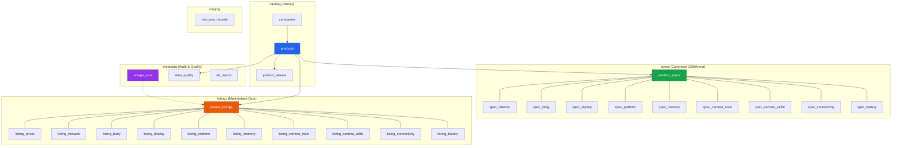

# Supabase Database Schema Guide (`schema_supabase.sql`)

This document provides a comprehensive technical reference for the **MobileInfoAnalytics Supabase PostgreSQL Database Schema (v3)** defined in [`db/schema_supabase.sql`](file:///d:/Downloads/Repositories/MobileInfoAnalytics/db/schema_supabase.sql).

---

## 1. Architectural Philosophy

The schema is built to solve three fundamental challenges in multi-source mobile market analytics:

1. **Survival Without a Central Node**: In older designs, if GSMArena lacked a phone, all other site listings (Daraz, WhatMobile, etc.) failed to link. This schema introduces an abstract `catalog` layer that allows any scraper to create or link products independently using deterministic slugs and aliases.
2. **Per-Listing Specification Tracking**: Small spec differences between listings (e.g. 4GB vs 8GB RAM, Chinese vs Global variants) directly cause price differences. Every listing stores its own complete 9-category specification breakdown.
3. **Template V2 Native & Supabase RLS**: All 28 tables are fully typed to match [`template_v2.json`](file:///d:/Downloads/Repositories/MobileInfoAnalytics/filestorage/template_v2.json) with strict Row Level Security (RLS) policies configured for public access (`anon`), authenticated users, and backend admin pipelines (`service_role`).

---

## 2. Schema Hierarchy & Structure

The database organizes tables across **4 core schemas** plus **staging** and **analytics**:

```
├── catalog    -> Brand & Product Identity (Universal linking hub)
├── specs      -> Canonical / Best-Known Specifications (GSMArena truth)
├── listings   -> Scraped Market Listings & Per-Listing Specs (All sites)
├── metadata   -> Ingestion audit runs, quality scoring & error logs
├── staging    -> Raw JSON landing table for batch loading
├── etl        -> Ingestion procedures, functions & pipelines
└── analytics  -> Stable views for querying and dashboards
```



---

## 3. Schema & Table Breakdown

### 3.1 `catalog` Schema (Product Identity)

| Table | Purpose | Primary Key | Key Constraints |
|---|---|---|---|
| `catalog.companies` | Brand/Manufacturer master list | `company_id` | `company_slug` UNIQUE |
| `catalog.products` | Canonical abstract product hub | `product_id` | `product_slug` UNIQUE, FK to `companies` |
| `catalog.product_aliases` | Title variants mapped to product | `alias_id` | `alias_slug` UNIQUE, FK to `products` |

- **`company_slug`**: URL-safe string (e.g. `xiaomi`, `samsung`, `apple`).
- **`product_slug`**: Universal matching key (e.g. `xiaomi-redmi-note-14-4g`).
- **`created_by_source`**: Tracks which scraper first created the product record.

---

### 3.2 `specs` Schema (Canonical GSMArena Specifications)

All tables in `specs` use `product_id` as both Primary Key and Foreign Key (1:1 with `catalog.products`):

| Table | Description | Key Columns / template_v2 Mappings |
|---|---|---|
| `specs.product_specs` | Header table | `release_year`, `release_month`, `release_day`, `announced_text`, `status_text`, `colors TEXT[]`, `has_loudspeaker`, `has_3_5mm_jack`, `specs_source` |
| `specs.spec_network` | Cellular support | `supports_2g`, `supports_3g`, `supports_4g`, `supports_5g` |
| `specs.spec_body` | Physical dimensions | `dim_length_mm`, `dim_width_mm`, `dim_depth_mm`, `weight_grams`, `build_materials`, `has_normal_sim`, `has_nano_sim`, `has_esim`, `ip_rating`, `is_water_resistant`, `is_dust_resistant` |
| `specs.spec_display` | Screen hardware | `screen_technology` (CRT/LCD/LED/AMOLED/OLED), `refresh_rate_hz`, `peak_brightness_nits`, `resolution_width`, `resolution_height`, `aspect_ratio`, `pixel_density_ppi`, `screen_protection` |
| `specs.spec_platform` | SoC & OS | `operating_system`, `chipset_name`, `chipset_node_nm`, `cpu_description`, `gpu_name` |
| `specs.spec_memory` | Storage & RAM | `card_slot`, `storage_ram_variants JSONB` (e.g. `[[128, 6], [256, 8]]`), `technology` |
| `specs.spec_camera_main` | Rear cameras | `sensor_specs TEXT[]`, `photo_features`, `video_modes TEXT[]` |
| `specs.spec_camera_selfie` | Front camera | `sensor_specs TEXT[]`, `video_modes TEXT[]` |
| `specs.spec_connectivity` | Wireless & Ports | `wifi_standards`, `bluetooth_version`, `positioning_systems`, `has_nfc`, `has_infrared`, `has_fm_radio`, `has_usb_a`, `has_usb_b`, `has_micro_usb`, `has_usb_c`, `has_fp_rear`, `has_fp_side`, `has_fp_under_display` |
| `specs.spec_battery` | Power & Charging | `capacity_mah`, `has_wireless_charging`, `charging_specs TEXT[]` |

---

### 3.3 `listings` Schema (Marketplace Listings & Individual Specs)

Marketplace listings store data from `daraz.pk`, `whatmobile.com.pk`, `mega.pk`, `mymobile.pk`, etc.

| Table | Description | Key Features |
|---|---|---|
| `listings.market_listings` | Master listing record | `listing_id` (PK), `product_id` (FK), `instance_number`, `source_domain`, `source_url` (UNIQUE), `listing_title`, `raw_payload JSONB`. UNIQUE on `(product_id, source_domain, instance_number)` |
| `listings.listing_prices` | Structured prices | `price_entry_id` (PK), `listing_id` (FK), `currency_code` (`USD`, `EUR`, `GBP`, `PKR`), `amount NUMERIC(14,2)`, `price_index` |
| `listings.listing_*` (9 tables) | Per-listing spec sub-tables | Exactly mirrors the 9 `specs.spec_*` tables, but keyed by `listing_id` (PK/FK) to capture the exact specs scraped from that specific retailer. |

---

### 3.4 `metadata` Schema (Audit & Data Quality)

- **`metadata.scrape_runs`**: Logs batch ingestion jobs (`records_processed`, `records_succeeded`, `records_failed`, `run_status`).
- **`metadata.etl_rejects`**: Captures unparseable or rejected JSON payloads with detailed PostgreSQL error diagnostics.
- **`metadata.data_quality`**: Calculates a `completeness_pct` score (0.00% to 100.00%) based on the count of populated non-null fields.

---

### 3.5 `staging` Schema

- **`staging.raw_json_records`**: A landing queue for batch importing files from disk/S3 before invoking the parsing procedures.

---

## 4. Row Level Security (RLS) & Permissions

RLS is enabled on **all 28 tables** with the following access policy matrix:

| Schema / Tables | `anon` (Public API) | `authenticated` (Users) | `service_role` (ETL / Admin) |
|---|---|---|---|
| `catalog.*` | `SELECT` (Read-only) | `SELECT` (Read-only) | `ALL` (Full CRUD) |
| `specs.*` | `SELECT` (Read-only) | `SELECT` (Read-only) | `ALL` (Full CRUD) |
| `listings.*` | `SELECT` (Read-only) | `SELECT` (Read-only) | `ALL` (Full CRUD) |
| `metadata.data_quality` | `SELECT` (Read-only) | `SELECT` (Read-only) | `ALL` (Full CRUD) |
| `metadata.scrape_runs` | ❌ Blocked | `SELECT` (Read-only) | `ALL` (Full CRUD) |
| `metadata.etl_rejects` | ❌ Blocked | ❌ Blocked | `ALL` (Full CRUD) |
| `staging.*` | ❌ Blocked | ❌ Blocked | `ALL` (Full CRUD) |
| `analytics.*` (Views) | `SELECT` (Read-only) | `SELECT` (Read-only) | `SELECT` |

---

## 5. Deployment Instructions

1. Open your **Supabase Dashboard** -> **SQL Editor**.
2. Copy and paste the entire contents of [`db/schema_supabase.sql`](file:///d:/Downloads/Repositories/MobileInfoAnalytics/db/schema_supabase.sql).
3. Click **Run**.
4. Next, deploy [`db/functions_supabase.sql`](file:///d:/Downloads/Repositories/MobileInfoAnalytics/db/functions_supabase.sql) (refer to [`README_FUNCTIONS_SUPABASE.md`](file:///d:/Downloads/Repositories/MobileInfoAnalytics/db/README_FUNCTIONS_SUPABASE.md)).
