# MobileInfoAnalytics — Database Architecture V3

## Design Principles

1. **Every listing stores its own full specs** — even if it's the same phone, tiny spec differences across sites explain price differences, so each listing gets its own complete set of data tables.
2. **No analytics schema** — scraping is done once. Price is recorded once per listing. Cross-site price comparison is done by querying listings, not by tracking price history over time.
3. **Product linking survives without GSMArena** — the `catalog` schema is source-independent. Any scraper can create or find products via slug + alias matching.
4. **Instance tracking** — for each product, each source site can have multiple listings (instances), just like your original layout's `product_id + instance_number` pattern.

---

## The 4 Schemas

| Schema | Purpose | Color in diagrams |
|--------|---------|-------------------|
| `catalog` | Product identity — who is this phone? | 🔵 Blue |
| `specs` | Canonical GSMArena specifications (the "truth") | 🟢 Green |
| `listings` | Every marketplace listing with its own full specs | 🟠 Orange |
| `metadata` | Scrape run logs, data quality, error tracking | 🟣 Purple |

---

## Schema Overview

```mermaid
graph TB
    subgraph "catalog (Product Identity)"
        C1["companies"]
        C2["products"]
        C3["product_aliases"]
    end

    subgraph "specs (GSMArena Canonical Data)"
        S0["product_specs"]
        S1["spec_network"]
        S2["spec_body"]
        S3["spec_display"]
        S4["spec_platform"]
        S5["spec_memory"]
        S6["spec_camera_main"]
        S7["spec_camera_selfie"]
        S8["spec_connectivity"]
        S9["spec_battery"]
    end

    subgraph "listings (All Marketplace Data)"
        L0["market_listings"]
        LP["listing_prices"]
        L1["listing_network"]
        L2["listing_body"]
        L3["listing_display"]
        L4["listing_platform"]
        L5["listing_memory"]
        L6["listing_camera_main"]
        L7["listing_camera_selfie"]
        L8["listing_connectivity"]
        L9["listing_battery"]
    end

    subgraph "metadata (Audit Trail)"
        M1["scrape_runs"]
        M2["data_quality"]
        M3["etl_rejects"]
    end

    C1 -->|"company_id"| C2
    C2 -->|"product_id"| C3
    C2 -->|"product_id"| S0
    S0 --- S1 & S2 & S3 & S4 & S5 & S6 & S7 & S8 & S9
    C2 -->|"product_id"| L0
    L0 --- LP & L1 & L2 & L3 & L4 & L5 & L6 & L7 & L8 & L9
    L0 -->|"scrape_run_id"| M1
    C2 -->|"product_id"| M2

    style C1 fill:#4a90d9,stroke:#2c5f8a,color:#fff
    style C2 fill:#4a90d9,stroke:#2c5f8a,color:#fff
    style C3 fill:#4a90d9,stroke:#2c5f8a,color:#fff
    style S0 fill:#6ab04c,stroke:#3d7a2b,color:#fff
    style S1 fill:#6ab04c,stroke:#3d7a2b,color:#fff
    style S2 fill:#6ab04c,stroke:#3d7a2b,color:#fff
    style S3 fill:#6ab04c,stroke:#3d7a2b,color:#fff
    style S4 fill:#6ab04c,stroke:#3d7a2b,color:#fff
    style S5 fill:#6ab04c,stroke:#3d7a2b,color:#fff
    style S6 fill:#6ab04c,stroke:#3d7a2b,color:#fff
    style S7 fill:#6ab04c,stroke:#3d7a2b,color:#fff
    style S8 fill:#6ab04c,stroke:#3d7a2b,color:#fff
    style S9 fill:#6ab04c,stroke:#3d7a2b,color:#fff
    style L0 fill:#e67e22,stroke:#b35e14,color:#fff
    style LP fill:#e67e22,stroke:#b35e14,color:#fff
    style L1 fill:#e67e22,stroke:#b35e14,color:#fff
    style L2 fill:#e67e22,stroke:#b35e14,color:#fff
    style L3 fill:#e67e22,stroke:#b35e14,color:#fff
    style L4 fill:#e67e22,stroke:#b35e14,color:#fff
    style L5 fill:#e67e22,stroke:#b35e14,color:#fff
    style L6 fill:#e67e22,stroke:#b35e14,color:#fff
    style L7 fill:#e67e22,stroke:#b35e14,color:#fff
    style L8 fill:#e67e22,stroke:#b35e14,color:#fff
    style L9 fill:#e67e22,stroke:#b35e14,color:#fff
    style M1 fill:#9b59b6,stroke:#6c3483,color:#fff
    style M2 fill:#9b59b6,stroke:#6c3483,color:#fff
    style M3 fill:#9b59b6,stroke:#6c3483,color:#fff
```



---

## ER Diagram

```mermaid
erDiagram
    companies ||--o{ products : "manufactures"
    products ||--o{ product_aliases : "also known as"
    products ||--o| product_specs : "canonical specs"
    products ||--o{ market_listings : "listed on sites"
    products ||--o{ data_quality : "quality scored"

    product_specs ||--|| spec_network : "1:1"
    product_specs ||--|| spec_body : "1:1"
    product_specs ||--|| spec_display : "1:1"
    product_specs ||--|| spec_platform : "1:1"
    product_specs ||--|| spec_memory : "1:1"
    product_specs ||--|| spec_camera_main : "1:1"
    product_specs ||--|| spec_camera_selfie : "1:1"
    product_specs ||--|| spec_connectivity : "1:1"
    product_specs ||--|| spec_battery : "1:1"

    market_listings ||--o{ listing_prices : "priced at"
    market_listings ||--|| listing_network : "1:1"
    market_listings ||--|| listing_body : "1:1"
    market_listings ||--|| listing_display : "1:1"
    market_listings ||--|| listing_platform : "1:1"
    market_listings ||--|| listing_memory : "1:1"
    market_listings ||--|| listing_camera_main : "1:1"
    market_listings ||--|| listing_camera_selfie : "1:1"
    market_listings ||--|| listing_connectivity : "1:1"
    market_listings ||--|| listing_battery : "1:1"
    market_listings }o--|| scrape_runs : "scraped during"

    companies {
        serial company_id PK
        text company_name
        text company_slug UK
    }
    products {
        serial product_id PK
        int company_id FK
        text mobile_name
        text product_slug UK
        text created_by_source
    }
    product_aliases {
        serial alias_id PK
        int product_id FK
        text alias_name
        text alias_slug UK
        text source_domain
    }

    product_specs {
        int product_id PK_FK
        int release_year
        text release_month
        int release_day
        text announced_text
        text status_text
        text_arr colors
        bool has_loudspeaker
        bool has_3_5mm_jack
        text specs_source
    }
    spec_network {
        int product_id PK_FK
        bool supports_2g
        bool supports_3g
        bool supports_4g
        bool supports_5g
    }
    spec_body {
        int product_id PK_FK
        numeric dim_length_mm
        numeric dim_width_mm
        numeric dim_depth_mm
        numeric weight_grams
        text build_materials
        bool has_normal_sim
        bool has_nano_sim
        bool has_esim
        text ip_rating
        bool is_water_resistant
        bool is_dust_resistant
    }
    spec_display {
        int product_id PK_FK
        text screen_technology
        int refresh_rate_hz
        int peak_brightness_nits
        int resolution_width
        int resolution_height
        text aspect_ratio
        int pixel_density_ppi
        text screen_protection
    }
    spec_platform {
        int product_id PK_FK
        text operating_system
        text chipset_name
        int chipset_node_nm
        text cpu_description
        text gpu_name
    }
    spec_memory {
        int product_id PK_FK
        text card_slot
        jsonb storage_ram_variants
        text storage_technology
    }
    spec_camera_main {
        int product_id PK_FK
        text_arr sensor_specs
        text photo_features
        text_arr video_modes
    }
    spec_camera_selfie {
        int product_id PK_FK
        text_arr sensor_specs
        text_arr video_modes
    }
    spec_connectivity {
        int product_id PK_FK
        text wifi_standards
        text bluetooth_version
        text positioning_systems
        bool has_nfc
        bool has_infrared
        bool has_fm_radio
        bool has_usb_a
        bool has_usb_b
        bool has_micro_usb
        bool has_usb_c
        bool has_fp_rear
        bool has_fp_side
        bool has_fp_under_display
    }
    spec_battery {
        int product_id PK_FK
        int capacity_mah
        bool has_wireless_charging
        text_arr charging_specs
    }

    market_listings {
        serial listing_id PK
        int product_id FK
        int instance_number
        text source_domain
        text source_url UK
        text listing_title
        text announced_text
        text status_text
        int release_year
        text release_month
        int release_day
        text_arr colors
        bool has_loudspeaker
        bool has_3_5mm_jack
        int scrape_run_id FK
        timestamp scraped_at
    }
    listing_prices {
        serial price_entry_id PK
        int listing_id FK
        text currency_code
        numeric amount
    }
    listing_network {
        int listing_id PK_FK
        bool supports_2g
        bool supports_3g
        bool supports_4g
        bool supports_5g
    }
    listing_body {
        int listing_id PK_FK
        numeric dim_length_mm
        numeric dim_width_mm
        numeric dim_depth_mm
        numeric weight_grams
        text build_materials
        bool has_normal_sim
        bool has_nano_sim
        bool has_esim
        text ip_rating
        bool is_water_resistant
        bool is_dust_resistant
    }
    listing_display {
        int listing_id PK_FK
        text screen_technology
        int refresh_rate_hz
        int peak_brightness_nits
        int resolution_width
        int resolution_height
        text aspect_ratio
        int pixel_density_ppi
        text screen_protection
    }
    listing_platform {
        int listing_id PK_FK
        text operating_system
        text chipset_name
        int chipset_node_nm
        text cpu_description
        text gpu_name
    }
    listing_memory {
        int listing_id PK_FK
        text card_slot
        jsonb storage_ram_variants
        text storage_technology
    }
    listing_camera_main {
        int listing_id PK_FK
        text_arr sensor_specs
        text photo_features
        text_arr video_modes
    }
    listing_camera_selfie {
        int listing_id PK_FK
        text_arr sensor_specs
        text_arr video_modes
    }
    listing_connectivity {
        int listing_id PK_FK
        text wifi_standards
        text bluetooth_version
        text positioning_systems
        bool has_nfc
        bool has_infrared
        bool has_fm_radio
        bool has_usb_a
        bool has_usb_b
        bool has_micro_usb
        bool has_usb_c
        bool has_fp_rear
        bool has_fp_side
        bool has_fp_under_display
    }
    listing_battery {
        int listing_id PK_FK
        int capacity_mah
        bool has_wireless_charging
        text_arr charging_specs
    }

    scrape_runs {
        serial run_id PK
        text source_domain
        timestamp started_at
        timestamp finished_at
        int records_processed
        int records_succeeded
        int records_failed
        text run_status
    }
    data_quality {
        serial score_id PK
        int product_id FK
        text source_domain
        numeric completeness_pct
        int fields_populated
        int fields_total
    }
```

---

## Full Table Definitions

### Schema 1: `catalog`

#### `catalog.companies`
| Column | Type | Null? | Default | Notes |
|--------|------|-------|---------|-------|
| `company_id` | SERIAL | NOT NULL | auto | PK |
| `company_name` | TEXT | NOT NULL | — | e.g. "Xiaomi" |
| `company_slug` | TEXT | NOT NULL | — | e.g. "xiaomi" — **UNIQUE** |
| `created_at` | TIMESTAMP | NOT NULL | NOW() | |

#### `catalog.products`
| Column | Type | Null? | Default | Notes |
|--------|------|-------|---------|-------|
| `product_id` | SERIAL | NOT NULL | auto | PK — the universal link ID |
| `company_id` | INT | NOT NULL | — | FK → `catalog.companies` |
| `mobile_name` | TEXT | NOT NULL | — | e.g. "Redmi Note 14 4G" |
| `product_slug` | TEXT | NOT NULL | — | e.g. "xiaomi-redmi-note-14-4g" — **UNIQUE** |
| `created_by_source` | TEXT | NULL | — | Which site first created this product |
| `created_at` | TIMESTAMP | NOT NULL | NOW() | |
| `updated_at` | TIMESTAMP | NOT NULL | NOW() | |

#### `catalog.product_aliases`

> [!TIP]
> This is what solves cross-site linking. Daraz calls it "Xiaomi Redmi Note 14 4G (Global)", WhatMobile calls it "Redmi Note 14 4G". Both alias slugs map to the same `product_id`.

| Column | Type | Null? | Default | Notes |
|--------|------|-------|---------|-------|
| `alias_id` | SERIAL | NOT NULL | auto | PK |
| `product_id` | INT | NOT NULL | — | FK → `catalog.products` |
| `alias_name` | TEXT | NOT NULL | — | Exact name as seen on the source |
| `alias_slug` | TEXT | NOT NULL | — | Normalized slug — **UNIQUE** |
| `source_domain` | TEXT | NULL | — | Which site uses this variant |

---

### Schema 2: `specs` (GSMArena Canonical Data)

> These tables store the canonical "truth" specs, primarily from GSMArena. All sub-tables use `product_id` as both PK and FK — a 1:1 relationship, no synthetic ID indirection.

#### `specs.product_specs`
| Column | Type | Null? | Default | Maps to template_v2 |
|--------|------|-------|---------|---------------------|
| `product_id` | INT | NOT NULL | — | PK + FK → `catalog.products` |
| `release_year` | SMALLINT | NOT NULL | 2014 | `Year` |
| `release_month` | VARCHAR(3) | NOT NULL | 'DEC' | `Month` |
| `release_day` | SMALLINT | NULL | — | `Day` |
| `announced_text` | TEXT | NULL | — | `Announced` |
| `status_text` | TEXT | NULL | — | `Status` |
| `colors` | TEXT[] | NULL | — | `Colors` |
| `has_loudspeaker` | BOOLEAN | NOT NULL | TRUE | `Sound.Loudspeaker` |
| `has_3_5mm_jack` | BOOLEAN | NOT NULL | TRUE | `Sound.3.5mm jack` |
| `specs_source` | TEXT | NOT NULL | — | Which site provided this data |

#### `specs.spec_network`
| Column | Type | Null? | Default | Maps to |
|--------|------|-------|---------|---------|
| `product_id` | INT | NOT NULL | — | PK + FK |
| `supports_2g` | BOOLEAN | NOT NULL | TRUE | `Network.2G` |
| `supports_3g` | BOOLEAN | NOT NULL | TRUE | `Network.3G` |
| `supports_4g` | BOOLEAN | NOT NULL | FALSE | `Network.4G` |
| `supports_5g` | BOOLEAN | NOT NULL | FALSE | `Network.5G` |

#### `specs.spec_body`
| Column | Type | Null? | Default | Maps to |
|--------|------|-------|---------|---------|
| `product_id` | INT | NOT NULL | — | PK + FK |
| `dim_length_mm` | NUMERIC(6,1) | NOT NULL | 50.0 | `Body.Dimensions.DimensionA` |
| `dim_width_mm` | NUMERIC(6,1) | NOT NULL | 50.0 | `Body.Dimensions.DimensionB` |
| `dim_depth_mm` | NUMERIC(5,1) | NOT NULL | 5.0 | `Body.Dimensions.DimensionC` |
| `weight_grams` | NUMERIC(6,1) | NOT NULL | 25.0 | `Body.Weight` |
| `build_materials` | TEXT | NULL | — | `Body.Build` |
| `has_normal_sim` | BOOLEAN | NOT NULL | FALSE | `Body.Normal-SIM` |
| `has_nano_sim` | BOOLEAN | NOT NULL | TRUE | `Body.Nano-SIM` |
| `has_esim` | BOOLEAN | NOT NULL | FALSE | `Body.E-SIM` |
| `ip_rating` | TEXT | NULL | — | `Body.Resistance-Standard` |
| `is_water_resistant` | BOOLEAN | NOT NULL | FALSE | `Body.Resistance-Water` |
| `is_dust_resistant` | BOOLEAN | NOT NULL | TRUE | `Body.Resistance-Dust` |

#### `specs.spec_display`
| Column | Type | Null? | Default | Maps to |
|--------|------|-------|---------|---------|
| `product_id` | INT | NOT NULL | — | PK + FK |
| `screen_technology` | TEXT | NOT NULL | 'LCD' | `Display.Screen` (CRT/LCD/LED/AMOLED/OLED) |
| `refresh_rate_hz` | INT | NOT NULL | 60 | `Display.Refresh-Rate` |
| `peak_brightness_nits` | INT | NOT NULL | 60 | `Display.Brightness` |
| `resolution_width` | INT | NOT NULL | 240 | `Display.ResolutionA` |
| `resolution_height` | INT | NOT NULL | 240 | `Display.ResolutionB` |
| `aspect_ratio` | TEXT | NULL | — | `Display.Ratio` |
| `pixel_density_ppi` | INT | NULL | — | `Display.Pixel-Density` |
| `screen_protection` | TEXT | NULL | — | `Display.Protection` |

#### `specs.spec_platform`
| Column | Type | Null? | Default | Maps to |
|--------|------|-------|---------|---------|
| `product_id` | INT | NOT NULL | — | PK + FK |
| `operating_system` | TEXT | NULL | — | `Platform.OS` |
| `chipset_name` | TEXT | NULL | — | `Platform.Chipset` |
| `chipset_node_nm` | INT | NULL | — | `Platform.Chipset-Size` |
| `cpu_description` | TEXT | NULL | — | `Platform.CPU` |
| `gpu_name` | TEXT | NULL | — | `Platform.GPU` |

#### `specs.spec_memory`
| Column | Type | Null? | Default | Maps to |
|--------|------|-------|---------|---------|
| `product_id` | INT | NOT NULL | — | PK + FK |
| `card_slot` | TEXT | NULL | — | `Memory.Card slot` |
| `storage_ram_variants` | JSONB | NOT NULL | '[[0,0]]' | `Memory.Types` — array of [storage_gb, ram_gb] |
| `storage_technology` | TEXT | NULL | — | `Memory.Technology` |

#### `specs.spec_camera_main`
| Column | Type | Null? | Default | Maps to |
|--------|------|-------|---------|---------|
| `product_id` | INT | NOT NULL | — | PK + FK |
| `sensor_specs` | TEXT[] | NULL | — | `Main Camera.Specifications` |
| `photo_features` | TEXT | NULL | — | `Main Camera.Features` |
| `video_modes` | TEXT[] | NULL | — | `Main Camera.Video` |

#### `specs.spec_camera_selfie`
| Column | Type | Null? | Default | Maps to |
|--------|------|-------|---------|---------|
| `product_id` | INT | NOT NULL | — | PK + FK |
| `sensor_specs` | TEXT[] | NULL | — | `Selfie Camera.Specifications` |
| `video_modes` | TEXT[] | NULL | — | `Selfie Camera.Video` |

#### `specs.spec_connectivity`
| Column | Type | Null? | Default | Maps to |
|--------|------|-------|---------|---------|
| `product_id` | INT | NOT NULL | — | PK + FK |
| `wifi_standards` | TEXT | NULL | — | `Features.WLAN` |
| `bluetooth_version` | TEXT | NULL | — | `Features.Bluetooth` |
| `positioning_systems` | TEXT | NULL | — | `Features.Positioning` |
| `has_nfc` | BOOLEAN | NOT NULL | FALSE | `Features.NFC` |
| `has_infrared` | BOOLEAN | NOT NULL | FALSE | `Features.Infrared port` |
| `has_fm_radio` | BOOLEAN | NOT NULL | TRUE | `Features.Radio` |
| `has_usb_a` | BOOLEAN | NOT NULL | FALSE | `Features.USB-A` |
| `has_usb_b` | BOOLEAN | NOT NULL | FALSE | `Features.USB-B` |
| `has_micro_usb` | BOOLEAN | NOT NULL | TRUE | `Features.Micro-USB` |
| `has_usb_c` | BOOLEAN | NOT NULL | FALSE | `Features.USB-C` |
| `has_fp_rear` | BOOLEAN | NOT NULL | FALSE | `Features.BackFingerPrint` |
| `has_fp_side` | BOOLEAN | NOT NULL | FALSE | `Features.SideFingerPrint` |
| `has_fp_under_display` | BOOLEAN | NOT NULL | FALSE | `Features.InDisplayFingerPrint` |

#### `specs.spec_battery`
| Column | Type | Null? | Default | Maps to |
|--------|------|-------|---------|---------|
| `product_id` | INT | NOT NULL | — | PK + FK |
| `capacity_mah` | INT | NOT NULL | 0 | `Battery.Capacity` |
| `has_wireless_charging` | BOOLEAN | NOT NULL | FALSE | `Battery.WirelessCharging` |
| `charging_specs` | TEXT[] | NULL | — | `Battery.Charging` |

---

### Schema 3: `listings` (All Marketplace Data)

> Every listing from every site (daraz.pk, whatmobile.com.pk, mega.pk, etc.) goes here. Each listing stores its **own full specifications** because even small spec differences between sites explain price differences. The `instance_number` tracks "this is the Nth listing of this product from this site."

#### `listings.market_listings`
| Column | Type | Null? | Default | Notes |
|--------|------|-------|---------|-------|
| `listing_id` | SERIAL | NOT NULL | auto | PK |
| `product_id` | INT | NOT NULL | — | FK → `catalog.products` |
| `instance_number` | INT | NOT NULL | — | Per product+source counter. **UNIQUE** on (product_id, source_domain, instance_number) |
| `source_domain` | TEXT | NOT NULL | — | e.g. "daraz.pk", "whatmobile.com.pk" |
| `source_url` | TEXT | NOT NULL | — | Full URL — **UNIQUE** |
| `listing_title` | TEXT | NOT NULL | — | Raw product name from the website |
| `announced_text` | TEXT | NULL | — | |
| `status_text` | TEXT | NULL | — | |
| `release_year` | SMALLINT | NOT NULL | 2014 | |
| `release_month` | VARCHAR(3) | NOT NULL | 'DEC' | |
| `release_day` | SMALLINT | NULL | — | |
| `colors` | TEXT[] | NULL | — | |
| `has_loudspeaker` | BOOLEAN | NOT NULL | TRUE | |
| `has_3_5mm_jack` | BOOLEAN | NOT NULL | TRUE | |
| `scrape_run_id` | INT | NULL | — | FK → `metadata.scrape_runs` |
| `scraped_at` | TIMESTAMP | NOT NULL | NOW() | When this listing was scraped |

#### `listings.listing_prices`

> [!NOTE]
> Prices are structured with currency codes instead of untyped arrays. For a single listing, there may be multiple price entries (USD, EUR, GBP, PKR).

| Column | Type | Null? | Default | Notes |
|--------|------|-------|---------|-------|
| `price_entry_id` | SERIAL | NOT NULL | auto | PK |
| `listing_id` | INT | NOT NULL | — | FK → `listings.market_listings` |
| `currency_code` | VARCHAR(3) | NOT NULL | 'PKR' | ISO: USD, EUR, GBP, PKR |
| `amount` | NUMERIC(12,2) | NOT NULL | — | Price amount |

#### `listings.listing_network`
Same columns as `specs.spec_network`, but keyed by `listing_id` instead of `product_id`.

| Column | Type | Null? | Default |
|--------|------|-------|---------|
| `listing_id` | INT | NOT NULL | — | PK + FK → `listings.market_listings` |
| `supports_2g` | BOOLEAN | NOT NULL | TRUE |
| `supports_3g` | BOOLEAN | NOT NULL | TRUE |
| `supports_4g` | BOOLEAN | NOT NULL | FALSE |
| `supports_5g` | BOOLEAN | NOT NULL | FALSE |

#### `listings.listing_body`
| Column | Type | Null? | Default |
|--------|------|-------|---------|
| `listing_id` | INT | NOT NULL | — |
| `dim_length_mm` | NUMERIC(6,1) | NOT NULL | 50.0 |
| `dim_width_mm` | NUMERIC(6,1) | NOT NULL | 50.0 |
| `dim_depth_mm` | NUMERIC(5,1) | NOT NULL | 5.0 |
| `weight_grams` | NUMERIC(6,1) | NOT NULL | 25.0 |
| `build_materials` | TEXT | NULL | — |
| `has_normal_sim` | BOOLEAN | NOT NULL | FALSE |
| `has_nano_sim` | BOOLEAN | NOT NULL | TRUE |
| `has_esim` | BOOLEAN | NOT NULL | FALSE |
| `ip_rating` | TEXT | NULL | — |
| `is_water_resistant` | BOOLEAN | NOT NULL | FALSE |
| `is_dust_resistant` | BOOLEAN | NOT NULL | TRUE |

#### `listings.listing_display`
| Column | Type | Null? | Default |
|--------|------|-------|---------|
| `listing_id` | INT | NOT NULL | — |
| `screen_technology` | TEXT | NOT NULL | 'LCD' |
| `refresh_rate_hz` | INT | NOT NULL | 60 |
| `peak_brightness_nits` | INT | NOT NULL | 60 |
| `resolution_width` | INT | NOT NULL | 240 |
| `resolution_height` | INT | NOT NULL | 240 |
| `aspect_ratio` | TEXT | NULL | — |
| `pixel_density_ppi` | INT | NULL | — |
| `screen_protection` | TEXT | NULL | — |

#### `listings.listing_platform`
| Column | Type | Null? | Default |
|--------|------|-------|---------|
| `listing_id` | INT | NOT NULL | — |
| `operating_system` | TEXT | NULL | — |
| `chipset_name` | TEXT | NULL | — |
| `chipset_node_nm` | INT | NULL | — |
| `cpu_description` | TEXT | NULL | — |
| `gpu_name` | TEXT | NULL | — |

#### `listings.listing_memory`
| Column | Type | Null? | Default |
|--------|------|-------|---------|
| `listing_id` | INT | NOT NULL | — |
| `card_slot` | TEXT | NULL | — |
| `storage_ram_variants` | JSONB | NOT NULL | '[[0,0]]' |
| `storage_technology` | TEXT | NULL | — |

#### `listings.listing_camera_main`
| Column | Type | Null? | Default |
|--------|------|-------|---------|
| `listing_id` | INT | NOT NULL | — |
| `sensor_specs` | TEXT[] | NULL | — |
| `photo_features` | TEXT | NULL | — |
| `video_modes` | TEXT[] | NULL | — |

#### `listings.listing_camera_selfie`
| Column | Type | Null? | Default |
|--------|------|-------|---------|
| `listing_id` | INT | NOT NULL | — |
| `sensor_specs` | TEXT[] | NULL | — |
| `video_modes` | TEXT[] | NULL | — |

#### `listings.listing_connectivity`
| Column | Type | Null? | Default |
|--------|------|-------|---------|
| `listing_id` | INT | NOT NULL | — |
| `wifi_standards` | TEXT | NULL | — |
| `bluetooth_version` | TEXT | NULL | — |
| `positioning_systems` | TEXT | NULL | — |
| `has_nfc` | BOOLEAN | NOT NULL | FALSE |
| `has_infrared` | BOOLEAN | NOT NULL | FALSE |
| `has_fm_radio` | BOOLEAN | NOT NULL | TRUE |
| `has_usb_a` | BOOLEAN | NOT NULL | FALSE |
| `has_usb_b` | BOOLEAN | NOT NULL | FALSE |
| `has_micro_usb` | BOOLEAN | NOT NULL | TRUE |
| `has_usb_c` | BOOLEAN | NOT NULL | FALSE |
| `has_fp_rear` | BOOLEAN | NOT NULL | FALSE |
| `has_fp_side` | BOOLEAN | NOT NULL | FALSE |
| `has_fp_under_display` | BOOLEAN | NOT NULL | FALSE |

#### `listings.listing_battery`
| Column | Type | Null? | Default |
|--------|------|-------|---------|
| `listing_id` | INT | NOT NULL | — |
| `capacity_mah` | INT | NOT NULL | 0 |
| `has_wireless_charging` | BOOLEAN | NOT NULL | FALSE |
| `charging_specs` | TEXT[] | NULL | — |

---

### Schema 4: `metadata`

#### `metadata.scrape_runs`
| Column | Type | Null? | Default | Notes |
|--------|------|-------|---------|-------|
| `run_id` | SERIAL | NOT NULL | auto | PK |
| `source_domain` | TEXT | NOT NULL | — | Which site was scraped |
| `started_at` | TIMESTAMP | NOT NULL | NOW() | |
| `finished_at` | TIMESTAMP | NULL | — | |
| `records_processed` | INT | NOT NULL | 0 | Total files processed |
| `records_succeeded` | INT | NOT NULL | 0 | Successfully stored |
| `records_failed` | INT | NOT NULL | 0 | Rejected/errored |
| `run_status` | TEXT | NOT NULL | 'running' | running / completed / failed |

#### `metadata.data_quality`
| Column | Type | Null? | Default | Notes |
|--------|------|-------|---------|-------|
| `score_id` | SERIAL | NOT NULL | auto | PK |
| `product_id` | INT | NOT NULL | — | FK → `catalog.products` |
| `source_domain` | TEXT | NOT NULL | — | |
| `completeness_pct` | NUMERIC(5,2) | NOT NULL | — | % of non-null fields (0.00–100.00) |
| `fields_populated` | INT | NOT NULL | — | Count of fields with real values |
| `fields_total` | INT | NOT NULL | — | Total possible fields |

#### `metadata.etl_rejects`
| Column | Type | Null? | Default | Notes |
|--------|------|-------|---------|-------|
| `reject_id` | SERIAL | NOT NULL | auto | PK |
| `scrape_run_id` | INT | NULL | — | FK → `metadata.scrape_runs` |
| `source_domain` | TEXT | NOT NULL | — | |
| `source_url` | TEXT | NULL | — | |
| `source_file` | TEXT | NULL | — | Local file path |
| `reject_reason` | TEXT | NOT NULL | — | e.g. "parse_failure", "missing_required_field" |
| `reject_detail` | TEXT | NULL | — | Human-readable error |
| `raw_payload` | JSONB | NULL | — | The failed JSON for debugging |
| `rejected_at` | TIMESTAMP | NOT NULL | NOW() | |

---

## How Cross-Site Comparison Works

The whole point of storing full specs per listing: you can now directly compare what different sites say about the same phone and correlate spec differences with price differences.

```sql
-- Example: Compare display specs and prices across all listings of the same phone
SELECT
    ml.source_domain,
    ml.listing_title,
    ml.instance_number,
    ld.screen_technology,
    ld.refresh_rate_hz,
    ld.resolution_width || 'x' || ld.resolution_height AS resolution,
    lp.currency_code,
    lp.amount AS price
FROM listings.market_listings ml
JOIN listings.listing_display ld ON ml.listing_id = ld.listing_id
JOIN listings.listing_prices lp ON ml.listing_id = lp.listing_id
WHERE ml.product_id = 42           -- Samsung Galaxy S25
  AND lp.currency_code = 'PKR'
ORDER BY lp.amount;
```

---

## Table Count Summary

| Schema | Tables | Purpose |
|--------|--------|---------|
| `catalog` | 3 | Product identity + aliases |
| `specs` | 10 | GSMArena canonical data |
| `listings` | 11 | All marketplace data with full specs |
| `metadata` | 3 | Audit trail |
| **Total** | **27** | — |

Compared to the original layout: 6 schemas × 10+ tables = **60+ tables**. This design achieves the same data coverage with **27 tables** across 4 schemas.
